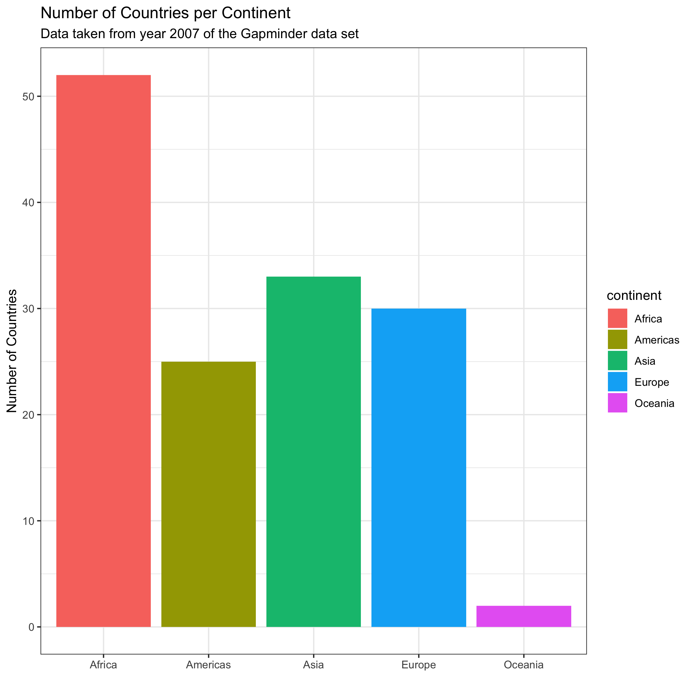

```{r setup, include=FALSE}
knitr::opts_chunk$set(echo = TRUE)
```

```{r}
library(gapminder)
library(tidyverse)
library(dplyr)
library(forcats)
library(ggplot2)
library(here)
```
Assignment 1:


I have filtered to remove Oceania. At first I just named the Continents that I did want,using :

no_oceania_gap <- c("Africa", "Americas", "Asia", "Europe")
no_oceania_gap <- gapminder %>%
  filter(continent %in% no_oceania_gap)
nlevels(no_oceania_gap$continent)

but then I thought it was a better idea to say that we want every continent except Oceania, using !=. Using nlevels, I can see that there are still five factors in the data set,desptite filtering out Oceania. I wanted to remove the factors, so I used drop(levels). Upon looking at the levels again, using nlevels, I can see that there are only four; one for each continent.  


```{r}
class(gapminder$continent)
str(gapminder$continent)

nlevels(gapminder$continent)
no_oceania_gap <- gapminder %>%
  filter(continent!= "Oceania")
nlevels(no_oceania_gap$continent)

dropped_oceania<- no_oceania_gap %>% 
  droplevels()

nlevels(dropped_oceania$continent)

#The Median life Expectancy of all continents except Oceania, before releveling.

no_oceania_gap%>%
  group_by(continent) %>%
  summarize(medianLifeExp = median(lifeExp))%>%
  ggplot() +
  geom_col(aes(continent,medianLifeExp)) +
  coord_flip()+
  theme_bw() +
  ylab("Median Life Expectancy") + xlab("Continent")

#Reordered version of oceania-free gapminder, based on the life expectancy. 

no_oceania_gap%>%
  group_by(continent) %>%
  summarize(medianLifeExp = median(lifeExp))%>%
  ggplot() +
  geom_col(aes(fct_reorder(continent, medianLifeExp, min), y=medianLifeExp)) +
  coord_flip()+
  theme_bw() +
  ylab("Median Life Expectancy") + xlab("Continent")

```


Assignment 1
```{r}

```


Assignment 3: I filtered to the gapminder data set in year 2007, and then grouped country. I summarized the median life expectancy of each country. I wrote the csv to my HW05 folder, and named it "CountryLifeExp.csv". When I read out the data, I read it out as "goodtime", because I thought it was a fun name.
```{r}
CountryLife<-(gapminder %>% 
  filter(year==2007) %>% 
    group_by(country) %>%
  summarize(medianLifeExp = median(lifeExp)) 
  )

write_csv(CountryLife, here::here("HW05", "CountryLifeExp.csv"))
          
goodtime<-read_csv(here("HW05", "CountryLifeExp.csv"))

goodtime
```
Assignment 4:  My previous work showed the number of countries per continent in year 2007, in black and white.
```{r}
previous
Continentcount<-(gapminder %>% 
filter(year==2007) %>%
count(continent)) 

Continentcount %>% 
  ggplot(aes(x = continent, y = n))+
    geom_bar(stat = "identity") +
    labs(x = "Continent",y = "Number of Countries")
      title = "Number of countries in each Continent"
      subtitle = "(based on 2007 gapminder data)

```

```{r}
#Now: I changed the bar graph so that each bar has a different colour to make it distinct. I removed the distracting grey background but kept the lines, so that you could still determine the number of countries, but it is more clear and clean. It was suggested in class to entirely remove the lines, but then you could not determine the number of countries. This was an in-between. I removed the x axis because it was redundant (those are evidently continents), but decided to keep the y axis, and put in a better title which properly explained the x and y axis. This makes the plot cleaner. The subtitle tells us where the data came from, however the subtitle dissappears when I add the plotly interactive component. I used plotly to make it interactive, so you can see data about how many countries are in a continent (denoted "n" when hovering) by hovering over the bar. I made this a seperate graph, so that one graph has the subtitle and is not interactive, and the other is an html widget. 
  
Continentcount<-(gapminder %>% 
filter(year==2007) %>%
count(continent)) 

PrePlotlyContinent <- Continentcount %>% 
  ggplot(aes(x = continent, y = n, fill=continent))+
    geom_bar(stat = "identity") +
labs(x="",
  y="Number of Countries",
  title = "Number of Countries per Continent", subtitle= "Data taken from year 2007 of the Gapminder data set"
  ) + theme_bw()

PrePlotlyContinent

PrePlotlyContinent %>% ggplotly()

```

Assignment 5

 I named the path to Homework 5 "p" and saved my.png in the HW05 folder. I could also save changes through that folder as well. I changed the Height, width, and units in "PrePlotlyContinent2"
```{r}
p<- here::here ("HW05")

ggsave(here("HW05", "PrePlotlyContinent.png"))
```

```{r}
ggsave("PrePlotlyContinent2.png", path=p,  width = 70, height = 20, units = "cm")
```

```{r}
ggsave("PrePlotlyContinentDPI.png", path=p,dpi=300)

#I changed the raster graphics using DPI. I needed to use path=p, otherwise it does not know where to save to.
```
